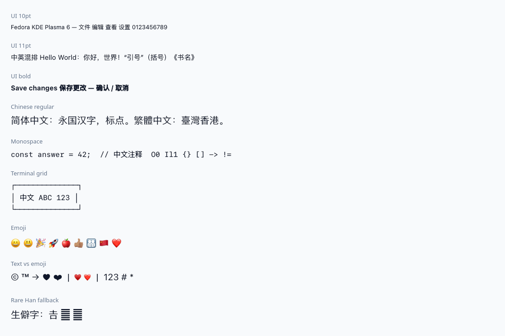

# Fedora KDE 的 Apple 风格字体配置

这套项目记录了 2026-09-09 在 Fedora 44 KDE Plasma 6、Wayland、`zh_CN.UTF-8`
环境中的实际安装与验证，包含字体文件、用户级 fontconfig、可重复执行的安装和回滚脚本。
目录名按本次约定保留为 `fedora-kde-apple-front`。

## 最终效果与选择

| 用途 | 字体与回退 |
| --- | --- |
| 西文界面 | SF Pro Text |
| 中文界面 | PingFang SC → Noto Sans CJK SC |
| 等宽西文 | SF Mono |
| 等宽中文 | Noto Sans Mono CJK SC |
| 普通符号 | 保留文本字体，补充 Noto Sans Symbols 2 |
| Emoji | Apple Color Emoji → Noto Color Emoji |
| 衬线 | 保留原系统配置 |

本机常规、菜单和标题为 10pt，工具栏 9pt，小字 8pt，等宽 10pt。
安装脚本读取并保留目标机器现有字号，不强行统一成 10pt。



## 下次安装：离线复用

完整离线包发布在 [GitHub Release：v1.0.0](https://github.com/zeke-chin/notes/releases/tag/fedora-kde-apple-front-v1.0.0)。
可下载 ZIP 和 `SHA256SUMS`，或者在一个空目录中执行：

```bash
gh release download fedora-kde-apple-front-v1.0.0 --repo zeke-chin/notes \
  --pattern 'fedora-kde-apple-front-v1.0.0.zip' --pattern 'SHA256SUMS'
sha256sum -c SHA256SUMS
unzip fedora-kde-apple-front-v1.0.0.zip
cd fedora-kde-apple-front
```

ZIP 内含安装脚本、配置、35 个字体和原始 Emoji RPM，可独立使用。
Release 附件不进入 Git 历史；GitHub 自动生成的 “Source code” 压缩包不包含这些附件，
应下载上面明确命名的 ZIP。Release 不包含本机 `history/original-state` 等个人配置备份。

把整个目录复制到目标机器，包含 `fonts/`。不要用 `sudo` 运行 Python 脚本。

1. 安装依赖。下面是 Fedora 包名；在其他发行版上需要自行调整：

   ```bash
   sudo dnf install python3 python3-pyside6 fontconfig kf6-kconfig \
     google-noto-sans-fonts google-noto-sans-mono-fonts \
     google-noto-sans-cjk-vf-fonts google-noto-sans-mono-cjk-vf-fonts \
     google-noto-sans-symbols-2-fonts google-noto-color-emoji-fonts
   ```

2. 进入本项目目录，先查看计划，再安装：

   ```bash
   python3 manage.py install --dry-run
   python3 manage.py install
   ```

3. 验证并查看预览：

   ```bash
   python3 manage.py verify
   python3 verify-font-trial.py
   ```

   第二条命令生成 `verification/qt-font-preview.png` 和实际字形记录。
   它包含两个已知不覆盖的生僻字样例，详情见下文。

4. 关闭并重新打开应用以加载新字体。若整个桌面有新旧字体混用，保存工作后注销再登录即可，
   无需重启电脑。脚本会发送 KDE 字体刷新通知，但不会关闭应用或注销会话。

### 安装脚本的行为

- 校验 `fonts-manifest.json` 中 35 个文件的 SHA-256。
- 安装到 `$XDG_DATA_HOME/fonts/apple-font-trial/`，默认 `~/.local/share/fonts/apple-font-trial/`。
- 配置写入 `$XDG_CONFIG_HOME/fontconfig/conf.d/60-apple-font-trial.conf`。
- 更新 `kdeglobals` 的常规、菜单、工具栏、小字、等宽和标题字体，保留原字号。
- 备份保存到 `$XDG_STATE_HOME/fedora-kde-apple-front/`，默认 `~/.local/state/fedora-kde-apple-front/`。
- 正常重复安装会提示已经安装，不覆盖现有状态。
- 检测到同名但不由此脚本管理的旧安装时会停止，避免覆盖旧备份。
- 如果安装过程的匹配验证失败，会撤回本次更改。
- 不删除 Noto，不安装整个 Emoji RPM，不修改 `/etc/fonts`，也不修改编辑器或终端的独立 profile。

已有其他字体规则、第三方 Emoji 包或其他发行版默认配置，可能影响结果；脚本中的匹配验证会暴露这些冲突。
本项目按 Fedora KDE 验证，不承诺在其他桌面环境直接通用。

## 状态与回滚

对于使用新脚本完成的安装：

```bash
python3 manage.py status
python3 manage.py rollback
```

回滚恢复本次更改前的 KDE 字体字段，把专属字体目录与配置移到备份目录，然后重建缓存。
无关 KDE 设置不受影响；如果某个字体字段后来被手动修改，脚本保留后续修改并提示。
如果这个后续修改仍引用已停用的字体，需要自行改回可用字体。
备份中的 `kdeglobals.before` 是原始配置全文，只用于人工恢复时参考，脚本不会整文件覆盖它。

### 当前这台机器的原始安装

本机现有效果是在整理项目之前安装的，因此由原试用脚本管理。
**现在无需再次运行新安装脚本。** 本机可直接执行 `python3 manage.py verify` 复查。

若要撤回当前原始试用，在本项目目录执行：

```bash
python3 history/rollback-font-trial.py
```

原始配置与安装清单已一起复制到 `history/original-state/`，这个历史回滚脚本直接使用此副本，
不依赖原工作目录。最初备份仍保存在 `/home/zeke/.local/state/apple-font-trial/20260909-171254/`。
历史清单记录的是当前机器的绝对路径；迁移时不要拿原始试用回滚脚本去操作新机器。
下一次用 `manage.py install` 安装后，统一用 `manage.py rollback`。
本节仅适用于当前机器的本地归档；Release ZIP 不包含旧试用回滚入口和本机备份。

## 字体来源与重新构建

| 内容 | 来源 | 本次使用方式 |
| --- | --- | --- |
| SF Pro Text | [Apple 官方字体页](https://developer.apple.com/fonts/)的 SF-Pro.dmg | 仅安装 SF-Pro-Text 静态 OTF，共 18 个 |
| SF Mono | 同上，SF-Mono.dmg | 12 个静态 OTF |
| PingFang SC | [yellowpeter2019/PingFangSC4Linux](https://github.com/yellowpeter2019/PingFangSC4Linux) | 固定 commit `a03bd9fe49edc1d1f7dd0ec334329e53ade5d9c5`，4 个 TTF |
| Apple Color Emoji | [samuelngs/apple-emoji-ttf](https://github.com/samuelngs/apple-emoji-ttf)的本地 RPM | `2.0.0-0.20260722.484daf4e.fc44`，仅提取 TTF |

精确 URL 和源文件校验值见 [sources.json](sources.json)，最终字体校验值见
[fonts-manifest.json](fonts-manifest.json)。Apple 的下载 URL 可能更新，而本项目固定的是此次验证过的文件。

本地已保存完整 `fonts/` 和原始 `assets/fonts-apple-color-emoji.rpm`。
如果 `fonts/` 丢失，可重新构建：

```bash
sudo dnf install 7zip curl rpm cpio
python3 prepare-fonts.py
```

脚本下载并校验 SF、苹方，将 DMG → PKG → gzip Payload → cpio 逐层解包，
从 RPM 中单独提取 Emoji TTF，最后校验所有成品字体。它不执行下载的安装脚本，不安装到系统。
若字体目录已存在且全部校验通过，会直接退出。

若只从 Git 获取了项目，`fonts/` 和 `assets/` 不在 Git 中。
优先下载上述 Release ZIP；如需从原始来源重建，也可另行提供此前归档的 RPM：

```bash
python3 prepare-fonts.py --emoji-rpm /path/to/fonts-apple-color-emoji.rpm
```

已有原始下载缓存时，可指定 `--cache /path/to/downloads`，避免再次下载。
要对照重建而不动现有字体目录，可指定 `--output /path/to/new-fonts`。
校验失败时脚本停止：先确认上游版本、字体名称和测试结果，再有意识地更新来源与成品清单，
不要为了跳过错误直接改校验值。

字体本身的许可仍由原作者决定；官方下载或社区重新打包不等于自由再分发授权。
尤其 Apple 字体的用途有限制，详见其下载页及包内许可。
`.gitignore` 已排除字体、RPM、下载缓存和本机原始备份；本地仍完整保留它们。
因此“复制完整目录”和“从 Git 克隆”的离线可用性不同。

### 维护 Release 附件

```bash
python3 package-release.py
```

输出位于被 Git 忽略的 `dist/`，包括 ZIP 和 `SHA256SUMS`。
打包脚本使用明确的文件清单，只收录可移植项目文件，不递归打包个人备份或工作目录。
发布新版本时应使用新的版本号和 tag，保留旧版本以便校验与复现。

## 本次修正的关键问题

1. Emoji RPM 附带系统级规则，会替换显式 `Noto Color Emoji` 请求。本项目不装其配置，保留 Noto 的独立可用性。
2. 社区苹方把各字重拆成不同 family，并全部标为 Regular。配置中的 `target="scan"` 只针对这些确切名称修正 family 和 weight，未修改字体二进制。
3. 除了泛型 `sans-serif`、`monospace`，还为显式 SF Pro Text、SF Mono 设置回退，实测 KDE/Qt 的中文选择。
4. 普通符号在 Emoji 之前加入 Noto Sans Symbols 2，避免文字样式的心形直接变成彩色 Emoji。
5. 等宽中文保留 Noto Sans Mono CJK SC；不把苹方直接作为终端中文默认。
6. TTC 本身可正常使用，当前 Noto CJK 就是 TTC，没有必要一律拆开。

## 测试结果与已知边界

- 48 组 Qt 检查：常用中文、中英混排、代码字符、符号，8/9/10/11/12/14pt，常规和粗体均无缺字。
- 18 个 Emoji 样例均形成单个 Apple Emoji 字形，含肤色职业、家庭、国旗、彩虹旗、按键、摇头、凤凰和青柠。
- 中文粗体实际使用苹方 Semibold；常规使用 Regular。
- Qt 与 Pango 的预览都已查看；单色心形的具体样式存在渲染差异。
- `𠮷` 可由 Noto 补齐；`𠀀`（U+20000）、`𪚥`（U+2A6A5）在当前全部字体中缺失。
- SF Mono 10pt 的 ASCII 宽度一致，但普通 Qt 排版中的中文自然宽度 13px，
  不是西文 8.031px 的严格两倍。预览框线可能错位，实际终端的字符格修正需在终端里另测。
- 预览属于本机离屏渲染，不等于已经验证每个浏览器、Flatpak、编辑器或实际终端。

新安装脚本在隔离的 XDG 目录中验证了预览不写入、安装、保留 11pt、重复安装、回滚、重复回滚，
以及回滚保留无关设置；测试不修改正在使用的桌面配置。
另已使用原始 DMG、固定版本的苹方 TTF 与归档 RPM 完整重建，35 个成品文件的 SHA-256 全部一致。

## 文件索引

```text
README.md                       本文：安装、来源、设计取舍、回滚
manage.py                       离线安装 / 检查 / 状态 / 回滚
prepare-fonts.py                 从固定来源重建字体目录
verify-font-trial.py             Qt 排版预览与 glyph run 记录
config/60-apple-font-trial.conf   最终用户级配置
fonts/                          已校验的 35 个字体（本地保留，Git 忽略）
assets/                         原始 Emoji RPM（本地保留，Git 忽略）
sources.json                    源文件 URL、版本、SHA-256
fonts-manifest.json             最终字体文件 SHA-256
verification/                   预览图、匹配数据、复测与脚本测试记录
history/                        原始 dart.md、实施记录、本机旧回滚入口
```

`history/dart.md` 保留最初方案供追溯，其中有已纠正内容；下次实施以本文和最终配置为准。
